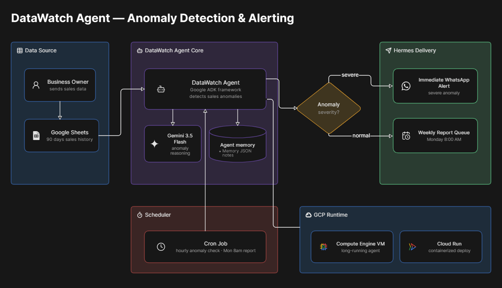

# DataWatch: Autonomous BI Agent for Emerging Markets

[](https://github.com/seye-sketch/Data-Eagle)
[](https://deepmind.google/technologies/gemini/)
[](https://www.google.com/sheets/about/)
[](LICENSE)

An autonomous business intelligence and anomaly detection agent built using the **Google Agent Development Kit (ADK)** and **Gemini 3.5 Flash**. Designed specifically for the **Google "All Things Agentic" Hackathon (Taskmaster track)**.

---

## Problem Statement & Project Overview

Imagine **Tunde**, a small business owner in Lagos, Nigeria. Tunde runs **three busy Suya spots** across Lagos (Ikeja, Surulere, and Lekki). He does great business daily but faces significant challenges:
- He **cannot afford** a full-time data analyst or complex BI tools (like Power BI / Tableau enterprise licenses).
- He is constantly busy managing suppliers, staff, and operations, leaving zero time to pore over spreadsheets.
- Critical business events—such as a sudden **99% drop in hourly sales** at Ikeja due to a power outage, or supplier inflation eating his margins—often go unnoticed until it's too late.

### The Solution: DataWatch
**DataWatch** acts as Tunde's private, autonomous data analyst. It runs quietly in the background on **Cloud Run**, connects directly to his sales spreadsheets, reasons about performance using the advanced cognitive capabilities of **Gemini 3.5 Flash**, and sends him simple, actionable **WhatsApp alerts** and weekly summaries. It brings enterprise-grade intelligence to emerging market entrepreneurs for pennies a day.

---

## Key Features

- **Gemini-Powered Anomaly Detection:** Uses Gemini 3.5 Flash to intelligently analyze sales patterns, accounting for local contexts (e.g., Nigerian public holidays, heavy rain season, or power grid failures) to separate noise from true business anomalies.
- **Seamless Google Sheets Integration:** Automatically pulls and syncs transaction records from Google Sheets, using it as a lightweight, free database for the business owner.
- **Instant WhatsApp Alerts:** When a severe anomaly (e.g., 90%+ sudden revenue drop during peak hours) is detected, DataWatch instantly alerts the owner via WhatsApp with exact numbers and causes.
- **Weekly Business Reports:** Automatically compiles structured weekly performance reports, charts business trends using Matplotlib, and delivers them directly to the owner.
- **Automated Cron Schedule:** Runs on a lightweight, scheduled cron cycle to check sales data hourly/daily, operating with 100% autonomy.

---

## Architecture



- **Google Agentic SDK (ADK):** Powers the autonomous agent loop, managing tool bindings and memory across runs.
- **Gemini 3.5 Flash:** Provides lightning-fast, high-quality reasoning to analyze sales data and formulate context-aware explanations.
- **Google Sheets API:** Serves as the free, accessible data entry and storage layer for the merchant.
- **Cloud Run & Cron:** Hosts the lightweight execution environment, triggered autonomously every hour/day.

---

## How It Works

1. **Data Ingestion (90-Day History):** DataWatch pulls the last 90 days of transactions from Google Sheets to establish a statistical baseline for each branch (Ikeja, Surulere, Lekki).
2. **Daily Aggregation:** Each day/hour, sales are aggregated and analyzed.
3. **Cognitive Reasoning:** Gemini 3.5 Flash compares the fresh hourly data against historical baselines, factoring in:
   - Time of day (e.g., peak lunch/dinner hours vs. morning lulls).
   - Historical branch variance.
   - Known local anomalies (power grid failure notes, public holidays).
4. **Actionable Outputs:**
   - **Severe Anomaly:** Fires an instant, high-priority WhatsApp alert.
   - **Daily/Weekly Recap:** Consolidates a structured weekly report, renders a trend visualization, and sends it directly to the owner.

---

## Setup Instructions

Follow these exact steps to set up and run the DataWatch agent locally:

1. **Clone the Repository:**
   ```bash
   git clone https://github.com/seye-sketch/Data-Eagle.git
   cd Data-Eagle
   ```

2. **Install Dependencies:**
   ```bash
   pip install -r requirements.txt
   ```

3. **Add Google Cloud Credentials:**
   Add your Google Cloud service account key file to the project root directory and name it `credentials.json`. Ensure the service account has access to your Google Sheet.

4. **Configure Environment Variables:**
   Create a `.env` file at `datawatch_agent/.env` with your Google Gemini API key:
   ```env
   GOOGLE_API_KEY=your_key
   ```

5. **Generate Baseline Historical Data:**
   ```bash
   python3 generate_data.py
   ```

6. **Inject a Test Anomaly:**
   ```bash
   python3 inject_anomaly.py
   ```

7. **Run the DataWatch Agent Loop:**
   ```bash
   adk run datawatch_agent
   ```

---

## Testing Instructions

To verify that the DataWatch anomaly detection and alerting workflow is operating correctly, follow this step-by-step test procedure:

1. **Verify Baseline Data:** Ensure that step 5 of the setup was run, creating the Google Sheets sales history.
2. **Inject Test Anomaly:** Run `python3 inject_anomaly.py`. This script simulates a point-of-sale failure at the Lekki branch during peak lunch hours, injecting a severely low sale amount (e.g., ₦200) directly into your transaction sheet.
3. **Execute Anomaly Scan:** Run the ADK agent loop using `adk run datawatch_agent` or run `python3 check_severe.py`.
4. **Inspect Alert Logs:** Check your terminal output and logs (or connected WhatsApp gateway). You should see that the agent successfully retrieved the transaction, flagged the 99% sales drop using Gemini reasoning, and triggered a severe anomaly alert with the specific branch details and suggested resolutions.

---

## Project Structure

```directory
datawatch/
├── datawatch_agent/
│   └── agent.py                # Main Google ADK Agent with four tools: analyze_sales, generate_chart, generate_report, remember
├── check_severe.py             # Hourly severe anomaly checker with WhatsApp alert
├── generate_data.py            # Simulates 90-day historical sales data for Ikeja, Surulere, Lekki
├── inject_anomaly.py           # Demo script to inject a live anomaly for testing
├── run_weekly.py               # Weekly report generator and WhatsApp sender
├── .env.example                # Environment variable template
├── .gitignore
└── README.md                   # Project documentation
```

---

## Built With

- **[Google Agentic SDK (ADK)](https://github.com/google/agentic-sdk):** Autonomous agent loop, scheduling, and tool binding.
- **[Gemini 3.5 Flash](https://deepmind.google/technologies/gemini/):** High-throughput reasoning, data analysis, and report generation.
- **[Google Sheets API (via gspread)](https://github.com/burnash/gspread):** Cloud data synchronization.
- **[Matplotlib](https://matplotlib.org/):** Business intelligence chart and trend rendering.
- **[Cloud Run](https://cloud.google.com/run):** Fully managed, serverless execution platform.

---

## License

This project is licensed under the MIT License - see the [LICENSE](LICENSE) file for details.

---

*Built with passion for emerging market merchants at the Google All Things Agentic Hackathon.*
